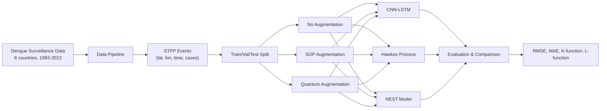

# Quantum-Augmented Spatio-Temporal Point Process for Dengue Forecasting in Southeast Asia

**Quantum-Enhanced Data Augmentation for Dengue Fever Prediction in Southeast Asia using Spatio-Temporal Point Process Models**

## Overview

This project investigates whether quantum generative models can produce more diverse and realistic synthetic dengue fever event sequences than classical augmentation methods, thereby improving the accuracy of spatio-temporal point process (STPP) forecasting models.

## Research Question

> Can quantum generative models produce more diverse and realistic synthetic dengue fever data that better preserves spatio-temporal structure compared to classical augmentation methods, thereby improving outbreak prediction accuracy?

## Architecture



## Pipeline

### Stage 1: Extended EDA
- Spatial autocorrelation (Moran's I)
- K-function and L-function analysis
- Seasonal decomposition
- Outbreak detection

### Stage 2: Data Pipeline
- Convert admin1-month aggregates to point events
- Geocode centroids for each region
- Create spatial grid for CNN input

### Stage 3: Baseline Models
- CNN-LSTM with spatial attention
- Multi-dimensional Hawkes Process
- Neural Spatio-Temporal Point Process (NEST-style)

### Stage 4: SOP Augmentation
- Second-Order Preserving permutations
- Validates K/L function preservation
- Baseline augmentation method

### Stage 5: Quantum Augmentation
- Quantum Born Machine (QBM)
- Variational Quantum Circuit Generator
- Hybrid Latent Style-Based QGAN
- Statistical validation (K/L function)

### Stage 6: Integrated Training
- Retrain all models with augmented data
- Compare: no aug vs SOP vs quantum
- Hyperparameter optimization (Optuna)

### Stage 7: Evaluation
- Forecasting metrics (RMSE, MAE, MAPE, R2)
- Point process quality (K-function, L-function, g(r))
- Statistical significance tests

## Setup

```bash
python3 -m venv .venv
source .venv/bin/activate
pip install -r requirements.txt
```

## Usage

```bash
# Run full pipeline
cd notebooks
jupyter notebook

# Or run scripts directly
python src/models/train_cnn_lstm.py --config configs/config.yaml
python src/augmentation/quantum_augment.py --config configs/config.yaml
```

## Data

- Source: TYCHO (Treating Infectious Diseases in the Changing World) dataset
- Coverage: 8 Southeast Asian countries
- Temporal: 1993-2022 (monthly)
- Spatial: Admin1 level (~233 provinces)
- Total cases: ~20.7 million

**Key Results (32×32 grid, 5 models, 6.2 min total)**

| Method | Val RMSE | Val R² | Val Pearson r |
|--------|----------|---------|---------------|
| Hawkes Process | 2,065 | — | — |
| CNN-LSTM (No Aug) | 2.48 | 0.855 | 0.935 |
| **CNN-LSTM + Quantum** | **2.46** | **0.858** | **0.967** |
| CNN-LSTM + SOP | 4.32 | 0.560 | 0.937 |
| NEST (No Aug) | 2.60 | 0.841 | 0.929 |
| NEST + SOP | 6.64 | −0.037 | 0.887 |

- **Best: CNN-LSTM + Quantum** — R² = 0.858, Pearson r = 0.967
- **Runtime: 6.2 minutes** on AMD Ryzen 7 7840HS (8 cores), CPU-only
- **Spatial clustering confirmed:** Indonesia (L=+169), Malaysia (L=+131), Vietnam (L=+72)

Full results in `docs/SYNTHESIS.md`.
