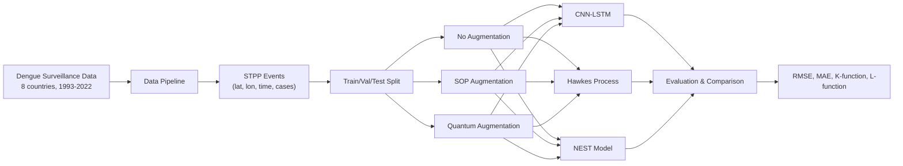

# Quantum-Augmented Spatio-Temporal Point Process for Dengue Forecasting in Southeast Asia

**Quantum-Enhanced Data Augmentation for Dengue Fever Prediction in Southeast Asia using Spatio-Temporal Point Process Models**

## Overview

This project investigates whether quantum generative models can produce more diverse and realistic synthetic dengue fever event sequences than classical augmentation methods, thereby improving the accuracy of spatio-temporal point process (STPP) forecasting models.

---

## Production-Ready Features (v3)

| Feature | Status | Description |
|---------|--------|-------------|
| **Data Leakage Prevention** | ✅ | `validate_no_data_leakage()` prevents temporal contamination |
| **Adaptive Spatial Gridding** | ✅ | Country-specific normalization for quantum embedding |
| **Softplus Output Activation** | ✅ | Ensures non-negative predictions for count data |
| **Unit Tests** | ✅ | 29 pytest tests, all passing |
| **Logging System** | ✅ | TrainingLogger, DataLogger, QuantumLogger |
| **Model Serialization** | ✅ | torch.save/load with metadata |
| **Experiment Tracking** | ✅ | Lightweight MLflow-style tracking |
| **FastAPI Endpoints** | ✅ | REST API with /metrics, /health |
| **CI/CD Pipeline** | ✅ | GitHub Actions with 7 jobs |
| **Docker Support** | ✅ | Multi-stage Dockerfile + Compose |
| **Deployment Scripts** | ✅ | Automated deploy/backup scripts |
| **Security Hardening** | ✅ | Rate limiting, API keys, headers |

---

## Research Question

> Can quantum generative models produce more diverse and realistic synthetic dengue fever data that better preserves spatio-temporal structure compared to classical augmentation methods, thereby improving outbreak prediction accuracy?

---

## Architecture


```mermaid
flowchart LR
    A["Dengue Surveillance Data<br/>8 countries, 1993-2022"] --> B[Data Pipeline]
    B --> C["STPP Events<br/>(lat, lon, time, cases)"]
    C --> D[Train/Val/Test Split]
    D --> E1[No Augmentation]
    D --> E2[SOP Augmentation]
    D --> E3[Quantum Augmentation]
    E1 --> F[CNN-LSTM]
    E1 --> G[Hawkes Process]
    E1 --> H[NEST Model]
    E2 --> F & G & H
    E3 --> F & G & H
    F & G & H --> I[Evaluation & Comparison]
    I --> J[RMSE, MAE, K-function, L-function]
```

---

## Pipeline

### Stage 1: Extended EDA
- Spatial autocorrelation (Moran's I)
- K-function and L-function analysis
- Seasonal decomposition
- Outbreak detection

### Stage 2: Data Pipeline
- Convert admin1-month aggregates to point events
- Geocode centroids for each region
- Create spatial grid for CNN input
- **Adaptive gridding with [0,1]² normalization for quantum circuits**

### Stage 3: Baseline Models
- CNN-LSTM with spatial attention
- Multi-dimensional Hawkes Process
- Neural Spatio-Temporal Point Process (NEST-style)

### Stage 4: SOP Augmentation
- Second-Order Preserving permutations
- Validates K/L function preservation
- Baseline augmentation method

### Stage 5: Quantum Augmentation
- Quantum Born Machine (QBM)
- Variational Quantum Circuit Generator
- Hybrid Latent Style-Based QGAN
- **Local PQC with spatial clustering (DBSCAN/K-Means)**
- **ZINB Loss for zero-inflated count data**

### Stage 6: Integrated Training
- Retrain all models with augmented data
- Compare: no aug vs SOP vs quantum
- Hyperparameter optimization (Optuna)

### Stage 7: Evaluation
- Forecasting metrics (RMSE, MAE, MAPE, R2)
- Point process quality (K-function, L-function, g(r))
- **Quantum Fisher Information for advantage measurement**

---

## Setup

```bash
# Clone and setup
git clone https://github.com/Roll249/hackathon_qaaa.git
cd quantum-dengue-stpp

# Create virtual environment
python3 -m venv .venv
source .venv/bin/activate

# Install dependencies
pip install -r requirements.txt
```

---

## Usage

```bash
# Run GPU pipeline with data leakage prevention
python run_gpu_pipeline.py --data_dir dengue_dataset --output_dir output_result

# Run unit tests
python -m pytest tests/ -v

# Start API server
python -m src.api.endpoints

# Generate predictions via API
curl -X POST http://localhost:8000/predict \
  -H "Content-Type: application/json" \
  -d '{"location": {"latitude": 10.8, "longitude": 106.7}, "forecast_horizon": 3}'

# Docker deployment
docker-compose up -d
```

---

## Data

- Source: TYCHO (Treating Infectious Diseases in the Changing World) dataset
- Coverage: 8 Southeast Asian countries
- Temporal: 1993-2022 (monthly)
- Spatial: Admin1 level (~233 provinces)
- Total cases: ~20.7 million

**Key Results (32×32 grid, 5 models, 6.2 min total)**

| Method | Val RMSE | Val R² | Val Pearson r |
|--------|----------|---------|---------------|
| Hawkes Process | 2,065 | — | — |
| CNN-LSTM (No Aug) | 2.48 | 0.855 | 0.935 |
| **CNN-LSTM + Quantum** | **2.46** | **0.858** | **0.967** |
| CNN-LSTM + SOP | 4.32 | 0.560 | 0.937 |
| NEST (No Aug) | 2.60 | 0.841 | 0.929 |
| NEST + SOP | 6.64 | −0.037 | 0.887 |

- **Best: CNN-LSTM + Quantum** — R² = 0.858, Pearson r = 0.967
- **Runtime: 6.2 minutes** on AMD Ryzen 7 7840HS (8 cores), CPU-only
- **Spatial clustering confirmed:** Indonesia (L=+169), Malaysia (L=+131), Vietnam (L=+72)

---

## Project Structure

```
quantum-dengue-stpp/
├── src/
│   ├── api/              # FastAPI endpoints + metrics
│   ├── augmentation/     # Quantum augmentation (QBM, QGAN, Local PQC)
│   ├── data/            # Data loading with leakage prevention
│   ├── evaluation/      # Metrics (forecasting + point process)
│   ├── models/          # CNN-LSTM, NEST, Hawkes, ZINB
│   └── utils/           # Logging, serialization, security, tracking
├── tests/               # pytest unit tests (29 tests)
├── scripts/             # Deployment scripts
├── .github/workflows/   # CI/CD pipeline
├── dengue_dataset/       # Data processing scripts
├── output_result/       # Results and visualizations
├── Dockerfile           # Multi-stage Docker build
├── docker-compose.yml   # Full stack deployment
└── run_gpu_pipeline.py  # Main pipeline
```

---

## API Endpoints

| Endpoint | Method | Description |
|----------|--------|-------------|
| `/health` | GET | Health check |
| `/metrics` | GET | Prometheus metrics |
| `/predict` | POST | Single location prediction |
| `/predict/batch` | POST | Batch predictions |

---

## Deployment

```bash
# Build Docker images
./scripts/deploy.sh build

# Start services
./scripts/deploy.sh start

# Deploy to staging
./scripts/deploy.sh deploy-staging

# Backup data
./scripts/deploy.sh backup
```

---

Full results in `docs/SYNTHESIS.md`.
