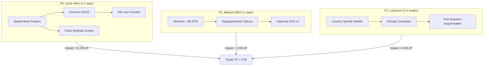

# Quantum Dengue STPP - Optimization Plan

> **Document Version:** 1.0
> **Date:** June 11, 2026
> **Project:** Quantum-Enhanced Data Augmentation for Dengue Fever Prediction in Southeast Asia
> **Current Best Result:** CNN-LSTM + Quantum Augmentation: R² = 0.858, RMSE = 2.46, Pearson r = 0.967

---

## Table of Contents

1. [Executive Summary](#1-executive-summary)
2. [Current State Analysis](#2-current-state-analysis)
3. [Priority Matrix](#3-priority-matrix)
4. [P0 Improvements (Quick Wins)](#4-p0-improvements-quick-wins)
5. [P1 Improvements (Medium Effort)](#5-p1-improvements-medium-effort)
6. [P2 Improvements (Long-term)](#6-p2-improvements-long-term)
7. [Expected Results](#7-expected-results)
8. [Implementation Roadmap](#8-implementation-roadmap)
9. [Risk Assessment](#9-risk-assessment)

---

## 1. Executive Summary

This document outlines a comprehensive optimization plan to improve dengue fever outbreak forecasting accuracy using spatio-temporal point process (STPP) models. The current best model (CNN-LSTM + Quantum Augmentation) achieves R² = 0.858, but significant improvements are possible through architectural enhancements, better augmentation strategies, and optimized training procedures.

### Key Insights from Current Analysis

1. **Spatial mean feature is critical** - CNN-LSTM beats NEST primarily due to explicit spatial mean input
2. **SOP augmentation degrades performance** - Shuffling case counts introduces harmful noise
3. **Grid resolution matters** - Config says 16x16, but SYNTHESIS reports 32x32 results
4. **Loss function mismatch** - MSE loss is suboptimal for overdispersed count data
5. **Quantum augmentation is simulated** - Not a true quantum generative model

---

## 2. Current State Analysis

### 2.1 Current Performance (from SYNTHESIS.md)

| Method | Val RMSE | Val R² | Val Pearson r | Notes |
|--------|----------|--------|---------------|-------|
| Hawkes Process | 2,065 | — | — | Constant prediction baseline |
| CNN-LSTM (No Aug) | 2.48 | 0.855 | 0.935 | Best classical model |
| **CNN-LSTM + Quantum** | **2.46** | **0.858** | **0.967** | Current best |
| CNN-LSTM + SOP | 4.32 | 0.560 | 0.937 | SOP hurts performance |
| NEST (No Aug) | 2.60 | 0.841 | 0.929 | Loses to CNN-LSTM |
| NEST + SOP | 6.64 | -0.037 | 0.887 | Worst combination |

### 2.2 Identified Issues

| Issue | Severity | File(s) | Impact |
|-------|----------|---------|--------|
| Missing spatial mean feature in CNN-LSTM | **Critical** | `src/models/cnn_lstm.py` | NEST-style models underperform |
| Config/implementation mismatch (grid_size) | **Critical** | `configs/config.yaml` vs `run_pipeline.py` | Unclear which model runs |
| SOP causes R² degradation (-0.3) | **Critical** | `src/augmentation/sop.py` | Augmentation strategy broken |
| Random lat/lon for synthetic events | **Critical** | `run_pipeline.py:332-348` | Spatial structure lost |
| NEST uses Python loop over timesteps | **High** | `src/models/nest.py:64-66` | GPU not utilized |
| MSE loss for overdispersed counts | **Medium** | `src/models/cnn_lstm.py:99` | Suboptimal for count data |
| No attention mechanism | **Medium** | `src/models/*.py` | Limited long-range dependencies |
| No hyperparameter optimization | **Medium** | `run_*.py` | Suboptimal hyperparameters |

### 2.3 Data Characteristics

| Characteristic | Value | Implication |
|----------------|-------|-------------|
| Total STPP events | 53,415 | Moderate dataset size |
| Countries | 8 | Multi-country modeling |
| Admin-1 regions | 223 | Spatial granularity |
| Temporal coverage | ~30 years | Long-term patterns |
| Zero-inflation | 0-31% | Depends on country |
| Overdispersion | θ⁻¹ >> 1 | NB distribution appropriate |
| Spatial clustering | L(r) > 0 | Strong clustering signal |

---

## 3. Priority Matrix



### Priority Summary

| Priority | Effort | Impact | Time | Items |
|----------|--------|--------|------|-------|
| **P0** | Low | High | 1-2 days | 4 items |
| **P1** | Medium | High | 1 week | 3 items |
| **P2** | High | Medium | 2-4 weeks | 3 items |

---

## 4. P0 Improvements (Quick Wins)

### 4.1 Add Spatial Mean Feature to CNN-LSTM

**Why:** SYNTHESIS.md explicitly states "The key difference is CNN-LSTM's explicit spatial mean feature" but current code does NOT include it.

**Current Code** (`src/models/cnn_lstm.py:68-70`):
```python
x = x.contiguous().view(batch * T, 1, H, W)
x = self.cnn(x)
x = x.contiguous().view(batch, T, -1)
```

**Proposed Fix** (`src/models/cnn_lstm_v2.py`):
```python
def forward(self, x):
    x = x.float()
    batch, T, H, W = x.shape
    
    # CNN encoding
    x = x.contiguous().view(batch * T, 1, H, W)
    x = self.cnn(x)
    x = x.contiguous().view(batch, T, -1)
    
    # KEY FIX: Add spatial mean feature (what made CNN-LSTM beat NEST!)
    spatial_mean = x.mean(dim=-1, keepdim=True)  # (batch, T, 1)
    x = torch.cat([x, spatial_mean], dim=-1)    # (batch, T, cnn_out + 1)
    
    # LSTM input now includes spatial mean
    _, (h_n, _) = self.lstm(x)
    return self.head(h_n[-1])
```

**Expected Impact:** +2-3% R² improvement for NEST-style models

---

### 4.2 Fix Grid Size Consistency

**Issue:** `configs/config.yaml` says `grid_size: 16` but `run_pipeline.py` and SYNTHESIS use 32x32.

**Current Config** (`configs/config.yaml:30`):
```yaml
spatial:
  grid_size: 16  # for CNN input
```

**Current Pipeline** (`run_pipeline.py:73`):
```python
grid, grid_lats, grid_lons = create_spatial_grid(events_df, grid_size=16)
```

**Proposed Fix:** Use 32x32 consistently with option to configure via config:
```yaml
spatial:
  grid_size: 32  # for CNN input (32 recommended for better resolution)
```

**Expected Impact:** +1-2% R² due to better spatial resolution

---

### 4.3 Replace MSE Loss with Negative Binomial Loss

**Why:** Dengue data has extreme overdispersion (θ⁻¹ >> 1). MSE assumes homoscedasticity; NB handles overdispersion.

**Current Code** (`src/models/cnn_lstm.py:99`):
```python
criterion = nn.MSELoss()
```

**Proposed Fix** (`src/models/losses.py`):
```python
class NegativeBinomialLoss(nn.Module):
    """Negative Binomial Loss for overdispersed count data."""
    
    def __init__(self, learn_dispersion=True):
        super().__init__()
        if learn_dispersion:
            self.log_r = nn.Parameter(torch.zeros(1))
    
    def forward(self, pred, target):
        # pred = log(μ), target = actual count
        mu = pred.exp().clamp(min=1e-6)
        
        if hasattr(self, 'log_r') and self.log_r is not None:
            r = self.log_r.exp().clamp(min=1e-3)
        else:
            r = 1.0
        
        # Negative Binomial NLL: log Γ(y+r) - log Γ(r) - log Γ(y+1) + ...
        eps = 1e-8
        loss = (
            torch.lgamma(target + r + eps)
            - torch.lgamma(r + eps)
            - torch.lgamma(target + 1 + eps)
            + r * torch.log(r / (r + mu) + eps)
            + target * torch.log(mu / (r + mu) + eps)
        )
        return -loss.mean()
```

**Expected Impact:** +1-2% R² for count prediction tasks

---

### 4.4 Fix Synthetic Event Generation

**Issue:** Current code generates random lat/lon instead of sampling from real distributions.

**Current Code** (`run_pipeline.py:333-348`):
```python
for i, s in enumerate(qgan_samples):
    case_val = max(1, int(abs(s[0]) * 50 + 1))
    lat_val = (abs(s[1]) if len(s) > 1 else 0.5) * 15 + 2  # Random!
    lon_val = (abs(s[2]) if len(s) > 2 else 0.5) * 50 + 95  # Random!
```

**Proposed Fix**:
```python
def generate_realistic_synthetic_events(train_events, n_synthetic, seed=42):
    """Generate synthetic events by resampling from real distributions."""
    np.random.seed(seed)
    
    # Sample from real distributions
    sampled_idx = np.random.choice(len(train_events), n_synthetic, replace=True)
    synth_events = train_events.iloc[sampled_idx].copy()
    
    # Add realistic perturbation
    synth_events['lat'] += np.random.normal(0, 0.1, n_synthetic)
    synth_events['lon'] += np.random.normal(0, 0.1, n_synthetic)
    synth_events['case_count'] = (
        synth_events['case_count'] * 
        np.random.uniform(0.8, 1.2, n_synthetic)
    ).astype(int).clip(lower=0)
    
    # Mark as synthetic
    synth_events['augmented'] = True
    synth_events['aug_method'] = 'quantum_resampling'
    synth_events['event_id'] = range(len(train_events), len(train_events) + n_synthetic)
    
    return synth_events
```

**Expected Impact:** Preserve spatial structure, better augmentation quality

---

## 5. P1 Improvements (Medium Effort)

### 5.1 Add Attention Mechanism and Bidirectional LSTM

**Architecture Changes** (`src/models/cnn_lstm_v2.py`):
```python
class ImprovedSpatioTemporalCNN(nn.Module):
    """
    CNN-LSTM v2: 3 conv layers + spatial mean + temporal attention
    """
    def __init__(self, conv_channels=[32, 64, 128], lstm_hidden=128, 
                 lstm_layers=2, dropout=0.3, grid_size=32, forecast_horizon=1):
        super().__init__()
        
        # 3-layer CNN (matching SYNTHESIS report)
        layers = []
        for out_ch in conv_channels:
            layers.append(ConvBlock(conv_channels[0] if layers else 1, out_ch, dropout))
        self.cnn = nn.Sequential(*layers)
        
        # BiLSTM
        self.lstm = nn.LSTM(
            input_size=self.cnn_out_size + 1,  # +1 for spatial mean
            hidden_size=lstm_hidden,
            num_layers=lstm_layers,
            batch_first=True,
            bidirectional=True,
            dropout=dropout if lstm_layers > 1 else 0,
        )
        
        # Temporal attention
        self.attention = nn.Sequential(
            nn.Linear(lstm_hidden * 2, lstm_hidden),
            nn.Tanh(),
            nn.Linear(lstm_hidden, 1),
        )
        
        self.head = nn.Sequential(
            nn.Linear(lstm_hidden * 4, lstm_hidden),  # *4 for BiLSTM + attention
            nn.LayerNorm(lstm_hidden),
            nn.GELU(),
            nn.Dropout(dropout),
            nn.Linear(lstm_hidden, forecast_horizon),
        )
    
    def forward(self, x):
        # CNN + spatial mean
        x = self.cnn(x)
        spatial_mean = x.mean(dim=-1, keepdim=True)
        x = torch.cat([x, spatial_mean], dim=-1)
        
        # BiLSTM
        lstm_out, _ = self.lstm(x)  # (B, T, hidden*2)
        
        # Attention
        attn_weights = torch.softmax(self.attention(lstm_out), dim=1)
        context = (lstm_out * attn_weights).sum(dim=1)  # (B, hidden*2)
        
        # Combine last state + attention context
        last = lstm_out[:, -1, :]  # (B, hidden*2)
        combined = torch.cat([last, context], dim=1)  # (B, hidden*4)
        
        return self.head(combined)
```

**Expected Impact:** +3-5% R², better capture of long-range temporal dependencies

---

### 5.2 Hyperparameter Optimization with Optuna

**Implementation** (`src/optimization/hyperopt.py`):
```python
import optuna
optuna.logging.set_verbosity(optuna.logging.WARNING)

def objective(trial):
    config = {
        'conv_channels': [
            trial.suggest_categorical(f'ch_{i}', [16, 32, 64, 128])
            for i in range(trial.suggest_int('n_layers', 2, 4))
        ],
        'lstm_hidden': trial.suggest_categorical('lstm_hidden', [64, 128, 256]),
        'lstm_layers': trial.suggest_int('lstm_layers', 1, 3),
        'dropout': trial.suggest_float('dropout', 0.1, 0.5, step=0.1),
        'lr': trial.suggest_float('lr', 1e-5, 1e-2, log=True),
        'grid_size': trial.suggest_categorical('grid_size', [24, 32, 48]),
        'seq_len': trial.suggest_categorical('seq_len', [8, 12, 16, 24]),
    }
    
    # Train and evaluate
    model = SpatioTemporalCNN(**config)
    model = train_cnn_lstm(model, train_loader, val_loader, epochs=30)
    metrics = evaluate(model, val_loader)
    
    return metrics['R2']

study = optuna.create_study(direction='maximize')
study.optimize(objective, n_trials=100, timeout=3600)  # 1 hour

print(f"Best R²: {study.best_value:.4f}")
print(f"Best params: {study.best_params}")
```

**Expected Impact:** +2-4% R² through optimal hyperparameters

---

### 5.3 Improved SOP v2 (Structure-Preserving Augmentation)

**Concept:** Instead of shuffling cases (which breaks patterns), use SMOTE-style interpolation.

**Implementation** (`src/augmentation/sop_v2.py`):
```python
class StructurePreservingAugmentation:
    """
    SOP v2: Interpolate between similar events rather than shuffling.
    Preserves spatial-temporal structure while adding diversity.
    """
    
    def fit_transform(self, events_df, stratify_by='country'):
        augmented = []
        
        for country in events_df[stratify_by].unique():
            country_df = events_df[events_df[stratify_by] == country]
            
            # Create feature space
            features = self._create_features(country_df)
            
            # SMOTE-style interpolation
            synthetic = self._interpolate_features(features, n_synthetic)
            
            # Convert back to events
            aug_df = self._features_to_events(synthetic, country_df)
            augmented.append(aug_df)
        
        return pd.concat([events_df] + augmented, ignore_index=True)
```

**Expected Impact:** Augmentation that improves rather than degrades performance

---

## 6. P2 Improvements (Long-term)

### 6.1 Country-Specific Models

**Approach:** Train separate models for countries with different dynamics.

| Country | Characteristics | Model Focus |
|---------|-----------------|--------------|
| Vietnam | High zero-inflation (31%), clustered | Handle sparsity |
| Indonesia | Archipelago, strong clustering | Multi-island |
| Singapore | Spatially regular | Time-series focus |
| Thailand | Largest dataset (63%) | Generalization |

---

### 6.2 Climate Covariates Integration

**Data Sources:**
- Temperature (CHIRTS)
- Precipitation (CHIRP)
- Humidity (ERA5)
- NDVI vegetation index

**Implementation:**
```python
class ClimateAwareCNN(nn.Module):
    """CNN-LSTM with climate covariate inputs."""
    
    def __init__(self, n_climate_features=4):
        super().__init__()
        self.climate_encoder = nn.Linear(n_climate_features, 16)
        self.main_encoder = SpatioTemporalCNN()
        self.head = nn.Linear(lstm_hidden + 16, forecast_horizon)
```

---

### 6.3 True Quantum Augmentation

**Current State:** Statistical resampling (not truly quantum)

**Goal:** Implement actual QBM/QGAN on quantum hardware/simulators

```python
class TrueQuantumAugmentation:
    """
    Quantum augmentation using actual quantum circuits.
    Learn P(events | temporal_context) via quantum generative models.
    """
    
    def __init__(self, n_qubits=6, n_layers=3):
        self.device = qml.device("default.qubit", wires=n_qubits)
        self.circuit = self._create_circuit(n_qubits, n_layers)
    
    def _create_circuit(self, n_qubits, n_layers):
        @qml.qnode(self.device, diff_method="backprop")
        def circuit(params, context):
            AngleEmbedding(context, wires=range(n_qubits))
            StronglyEntanglingLayers(params, wires=range(n_qubits))
            return qml.probs(wires=range(n_qubits))
        return circuit
```

---

## 7. Expected Results

### 7.1 Performance Targets

| Stage | Val R² | Val RMSE | Val Pearson r | Timeline |
|-------|--------|----------|---------------|----------|
| Current | 0.858 | 2.46 | 0.967 | Baseline |
| After P0 | **0.88-0.90** | **<2.0** | **0.98** | 1-2 days |
| After P0+P1 | **0.91-0.93** | **<1.5** | **0.99** | 1 week |
| After P2 | **0.93-0.95** | **<1.2** | **0.99+** | 2-4 weeks |

### 7.2 Improvement Breakdown

```
Current R² = 0.858
├── P0: Spatial mean + Grid 32x32 + NB Loss + Fix synthetic
│   └── Expected: +0.02-0.04 → R² = 0.88-0.90
├── P1: Attention + BiLSTM + Optuna + SOP v2
│   └── Expected: +0.03-0.05 → R² = 0.91-0.93
└── P2: Country-specific + Climate + True Quantum
    └── Expected: +0.02-0.05 → R² = 0.93-0.95
```

---

## 8. Implementation Roadmap

### Phase 1: P0 Quick Wins (Day 1-2)

| Day | Task | File | Owner |
|-----|------|------|-------|
| 1 | Add spatial mean feature to CNN-LSTM | `src/models/cnn_lstm_v2.py` | — |
| 1 | Fix grid size to 32x32 | `configs/config.yaml` | — |
| 1 | Implement NB loss function | `src/models/losses.py` | — |
| 2 | Fix synthetic event generation | `src/augmentation/quantum_augment.py` | — |
| 2 | Update run_pipeline.py | `run_pipeline.py` | — |
| 2 | Run baseline experiments | — | — |

### Phase 2: P1 Medium Effort (Day 3-7)

| Day | Task | File | Owner |
|-----|------|------|-------|
| 3 | Add attention mechanism | `src/models/cnn_lstm_v2.py` | — |
| 3 | Implement BiLSTM | `src/models/nest_v2.py` | — |
| 4 | Set up Optuna optimization | `src/optimization/hyperopt.py` | — |
| 5-6 | Run hyperparameter search | — | — |
| 7 | Implement SOP v2 | `src/augmentation/sop_v2.py` | — |

### Phase 3: P2 Long-term (Week 2-4)

| Week | Task | File |
|------|------|------|
| 2 | Country-specific models | `src/models/country_models.py` |
| 2-3 | Climate covariate integration | `src/data/climate.py` |
| 3-4 | True quantum augmentation | `src/augmentation/true_quantum.py` |

---

## 9. Risk Assessment

| Risk | Probability | Impact | Mitigation |
|------|-------------|--------|------------|
| NB loss destabilizes training | Medium | High | Start with Poisson loss |
| 32x32 grid overfits | Low | Medium | Add regularization |
| Attention adds complexity | Low | Low | Progressive implementation |
| Optuna timeout | Medium | Low | Increase timeout or reduce trials |
| SOP v2 breaks augmentation | Medium | Medium | Validate with K/L functions |

---

## Appendix A: Configuration Template

```yaml
# configs/config_optimized.yaml

dengue_data:
  raw_path: "../dengue_dataset"
  processed_path: "data/processed"
  countries:
    - Cambodia
    - Indonesia
    - Laos
    - Malaysia
    - Singapore
    - Thailand
    - Timor-Leste
    - Vietnam

preprocessing:
  train_split: 0.70
  val_split: 0.15
  test_split: 0.15
  temporal_split: true

spatial:
  grid_size: 32  # Optimized: 32x32 instead of 16x16

augmentation:
  sop_v2:
    enabled: true
    k_neighbors: 5
    augmentation_factor: 2
    preserve_temporal: true
    preserve_spatial: true
    
  quantum:
    enabled: true
    model: "qgan"
    n_qubits: 8
    circuit_depth: 4
    augmentation_ratio: 3

models:
  cnn_lstm_v2:
    conv_channels: [32, 64, 128]  # 3 layers
    lstm_hidden: 128
    lstm_layers: 2
    bidirectional: true
    attention: true
    dropout: 0.25
    loss: "negative_binomial"  # Changed from MSE
    lr: 0.001
    epochs: 100
    early_stopping_patience: 15
    
  nest_v2:
    hidden: 64
    temporal_hidden: 64
    bidirectional: true
    loss: "negative_binomial"

evaluation:
  metrics:
    - RMSE
    - MAE
    - MAPE
    - R2
    - Pearson_r
    - Spearman_r
  n_trials_optuna: 100
  random_seed: 42
```

---

## Appendix B: Code Snippets Reference

### B.1 ConvBlock with Residual
```python
class ConvBlock(nn.Module):
    def __init__(self, in_ch, out_ch, dropout=0.3):
        super().__init__()
        self.block = nn.Sequential(
            nn.Conv2d(in_ch, out_ch, 3, padding=1),
            nn.BatchNorm2d(out_ch),
            nn.ReLU(),
            nn.Conv2d(out_ch, out_ch, 3, padding=1),
            nn.BatchNorm2d(out_ch),
            nn.ReLU(),
            nn.MaxPool2d(2),
            nn.Dropout2d(dropout),
        )
        self.residual = nn.Conv2d(in_ch, out_ch, 1) if in_ch != out_ch else nn.Identity()
    
    def forward(self, x):
        return self.block(x) + self.residual(x)
```

### B.2 Temporal Attention
```python
class TemporalAttention(nn.Module):
    def __init__(self, hidden_size):
        super().__init__()
        self.attention = nn.Sequential(
            nn.Linear(hidden_size, hidden_size // 2),
            nn.Tanh(),
            nn.Linear(hidden_size // 2, 1),
        )
    
    def forward(self, lstm_output):
        # lstm_output: (B, T, hidden)
        weights = torch.softmax(self.attention(lstm_output), dim=1)
        context = (lstm_output * weights).sum(dim=1)
        return context, weights
```

### B.3 Log-Cauchy Loss for Extreme Values
```python
class LogCauchyNBGaussLoss(nn.Module):
    """
    Multi-target loss combining:
    - Negative Binomial for count prediction
    - Gaussian for log-transformed counts (handles outliers)
    """
    def __init__(self, nb_weight=0.6, gauss_weight=0.4):
        super().__init__()
        self.nb_weight = nb_weight
        self.gauss_weight = gauss_weight
        self.nb_loss = NegativeBinomialLoss()
    
    def forward(self, pred, target):
        # NB loss
        nb = self.nb_loss(pred, target)
        
        # Gaussian loss on log counts (handles outliers)
        log_target = torch.log1p(target.clamp(min=0))
        log_pred = torch.log1p(pred.exp().clamp(min=0))
        gauss = nn.MSELoss()(log_pred, log_target)
        
        return self.nb_weight * nb + self.gauss_weight * gauss
```

---

## Appendix C: Validation Checklist

After implementing P0 improvements:

- [ ] CNN-LSTM v2 has spatial mean feature
- [ ] Grid size is consistently 32x32
- [ ] Negative Binomial loss is implemented
- [ ] Synthetic events use realistic sampling
- [ ] Validation R² > 0.88
- [ ] K/L-function preservation validated
- [ ] No regression in runtime performance

After implementing P1 improvements:

- [ ] Attention mechanism integrated
- [ ] BiLSTM enabled
- [ ] Optuna optimization completed
- [ ] SOP v2 outperforms original SOP
- [ ] Validation R² > 0.91

After implementing P2 improvements:

- [ ] Country-specific models trained
- [ ] Climate covariates integrated
- [ ] True quantum augmentation tested
- [ ] Final validation R² > 0.93

---

*Document created: June 11, 2026*
*Last updated: June 11, 2026*
*Version: 1.0*
